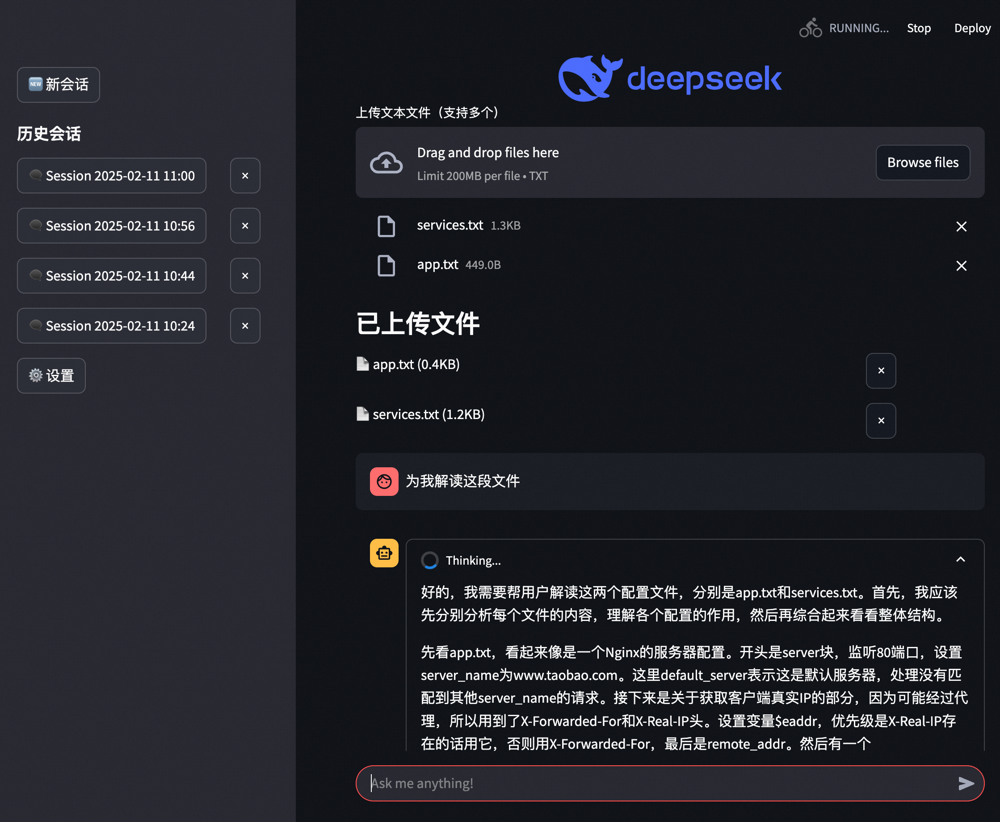
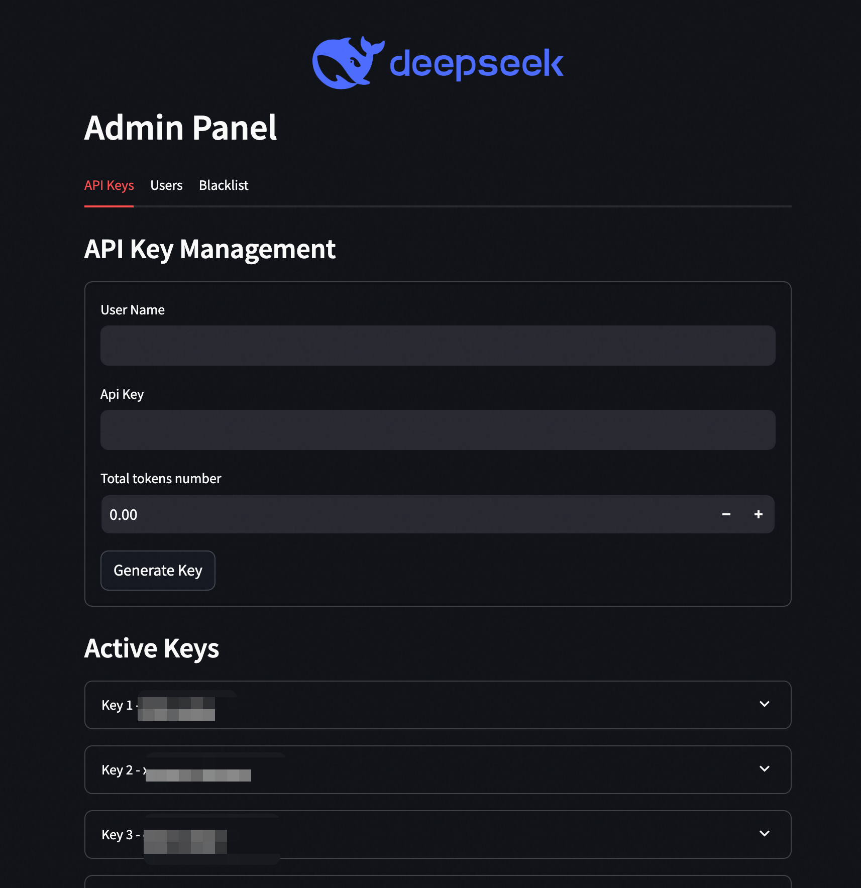
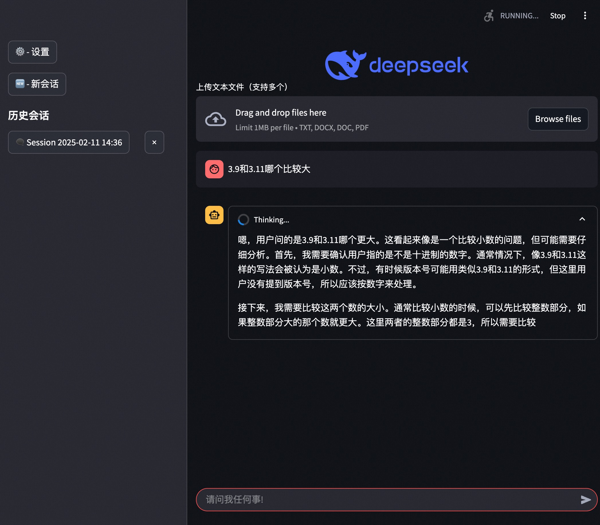

# DeepSeek Chat-UI 🚀

[](https://your-app-url.example.com)


基于Streamlit构建的智能聊天助手，集成深度思考模型与多用户管理系统，支持文件分析、会话管理和API密钥控制。
本实现主要调用阿里云的deepseek服务，因此需要部署者提前申请好阿里云百炼的api key，格式为sk-xxxx。


## 🌟 主要功能

- **多用户认证系统**
  - 用户注册/登录（支持密码哈希加密）
  - 管理员特权控制面板
  - 用户黑名单管理系统


- **智能对话功能**
  - 支持文件上传分析（TXT/DOC/DOCX/PDF）
  - 上下文感知对话（保留10条历史会话）
  - 双阶段响应机制（思考过程可视化）
  

- **API密钥管理**
  - 密钥配额控制（基于token计数）
  - 使用情况跟踪
  - 密钥吊销功能

- **其它特性**
  - SQLite数据库存储
  - 会话自动保存与恢复
  - 文件内容去重校验（MD5哈希）
  - 中文优化token计数算法

## 🛠️ 安装指南

1. 克隆仓库：
```bash
git clone https://github.com/GenerousMan/DeepSeek-Chat-UI.git
```

2. 安装依赖：
```bash
pip install -r requirements.txt
```

## 🖥️ 使用说明

1. 启动应用：
```bash
streamlit run app.py
```

2. 访问路径：
- **普通用户**：`http://localhost:8501`
- **管理员面板**：通过侧边栏设置按钮进入

3. 功能操作：
- 上传文件（单个文件最大1MB）
- 可点击创建新会话
- 可管理历史会话
- 普通用户可以登录后查看key的使用量
- 管理员可查看使用统计和密钥管理

## 📂 项目结构
```
├── app.py                 # 主应用逻辑
├── requirements.txt       # 依赖清单
├── uploads/               # 文件存储目录
├── app.db                 # 数据库文件
└── public/                # 静态资源
    └── deep-seek.png      # 品牌logo
```

## 🔧 技术架构

**核心组件**：
- Streamlit (Web框架)
- SQLite (数据库)
- bcrypt (密码哈希)
- textract (文件解析)
- DeepSeek API (AI模型)

**关键技术**：
- 会话状态管理
- 文件内容哈希校验
- Token配额算法（中文优化）
- 数据库事务处理
- 响应流式处理

## 🤝 贡献指南

欢迎通过以下方式参与贡献：
1. 提交Issue报告问题
2. 发起Pull Request改进代码
3. 完善项目文档
4. 添加测试用例

## ⚠️ 注意事项

- 生产环境部署前需：
  - 替换默认管理员凭证
  - 配置HTTPS加密
  - 定期备份数据库
- 文件解析功能依赖系统库：
  ```bash
  # Ubuntu系统需安装：
  sudo apt-get install -y poppler-utils tesseract-ocr

  # MacOS安装：
  brew install tesseract poppler
  ```


## 📄 许可证

本项目采用 [MIT License](LICENSE)，保留署名权利。

---

*本项目与DeepSeek品牌无官方关联，仅为技术演示用途。敏感操作前请做好数据备份。*